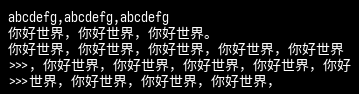
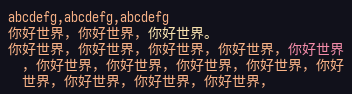

# text2png

通过文本生成图片，会自动计算折行，默认使用自带的等距更纱黑体（简体中文）字体

## 安装

```
pip install impaper
```

## 使用

默认提供了一个能够生成黑底白字的文本渲染器：

```py
from impaper import SimpleTextDrawer


std = SimpleTextDrawer()
std.conf.typesetting.indentation = ">>>"
im = std.draw(
    "abcdefg,abcdefg,abcdefg\n"
    "你好世界，你好世界，你好世界。\n"
    "你好世界，你好世界，你好世界，你好世界，你好世界，你好世界，你好世界，你好世界，你好世界，你好世界，你好世界，你好世界，你好世界，"
)
```

生成结果：



SimpleTextDrawer 的可配置项直接修改其属性即可，在文档字符串中有描述：

+ `self.fontsize` : 字号，默认14
+ `self.fg_color` : 字体颜色，默认白色 0xff
+ `self.bg_color` : 背景颜色，默认黑色 0x00
+ `self.ts.line_width` : 折行宽度，单位是字，默认 48
+ `self.ts.indentation` : 折行缩进符号，字符串，默认两个空格
+ `self.conf.font.path` : 重新指定一个字体，需要输入 TTF 格式的字体路径
+ `self.conf.layout.margin` : 上右下左顺序的四元组，单位 px，默认全 6px
+ `self.conf.layout.padding` : 上右下左顺序的四元组，单位 px，默认全 2px
+ `self.conf.layout.spacing` : 行距，单位 px，默认 2px

提供了一个可以根据标签切换颜色的文本渲染器 `ColorTextDrawer`。

```py
from impaper import ColorTextDrawer


ctd = ColorTextDrawer()
ctd.fg_color = ctd.conf.colors["Peach"]
im = ctd.draw(
    "abcdefg,abcdefg,abcdefg\n"
    "你好世界，你好世界，<Yellow>你好世界。<Reset/>\n"
    "你好世界，你好世界，你好世界，你好世界，<Red>你好世界<Reset/>，你好世界，你好世界，你好世界，你好世界，你好世界，你好世界，你好世界，你好世界，"
)
```

生成效果：



可以自定义的配置属性有：

+ `self.fontsize` : 字号，默认14
+ `self.fg_color` : 字体颜色，默认 Catppuccin Mocha 的 Text 色
+ `self.bg_color` : 背景颜色，默认 Catppuccin Mocha 的 Crust 色
+ `self.ts.line_width` : 折行宽度，单位是字，默认 48
+ `self.ts.indentation` : 折行缩进符号，字符串，默认两个空格
+ `self.conf.font.path` : 重新指定一个字体，需要输入 TTF 格式的字体路径
+ `self.conf.layout.margin` : 上右下左顺序的四元组，单位 px，默认全 6px
+ `self.conf.layout.padding` : 上右下左顺序的四元组，单位 px，默认全 2px
+ `self.conf.layout.spacing` : 行距，单位 px，默认 2px
+ `self.conf.colors` : 为一个字典，存储了 标签名 => HEX 格式的颜色

在文本中可以使用类似 HTML 的标签 `<Color>text<Reset/>` 来标记一段文本的颜色。
和 HTML 不同的是，只支持一种闭合标签 -- `<Reset/>`，作用是将颜色重设为默认
(即self.fg_color)。
